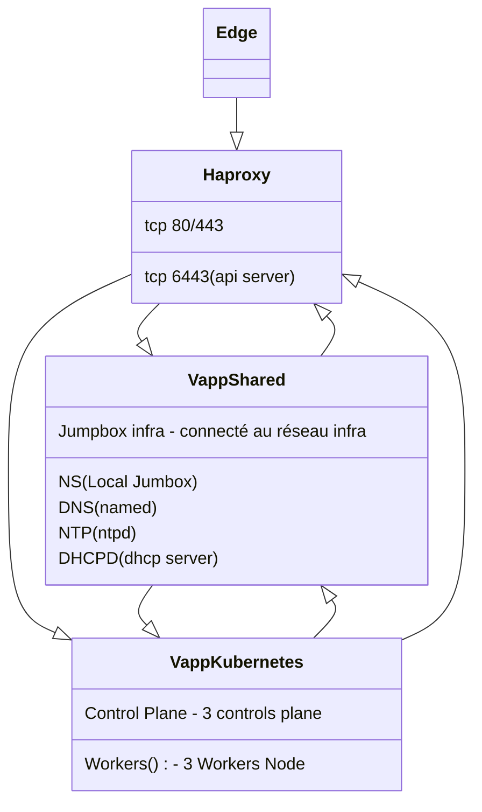

```mermaid
classDiagram
     Edge --|> Haproxy
     Haproxy --|> Vapp Shared
     Vapp Shared --|> Haproxy
     Haproxy --|> Vapp Kubernetes
     Vapp Shared --|> Vapp Kubernetes
     Vapp Kubernetes --|> Vapp Shared
     Vapp Kubernetes --|> Haproxy
     Haproxy : tcp 6443 (api server)
     Haproxy : tcp 80/443
     class Vapp Shared{
             Jumpbox infra - connecté au réseau infra
             NS(Local Jumbox)
             DNS(named)
             NTP(ntpd)
             DHCPD(dhcp server)
             
     }
     class Vapp Kubernetes{
             Control Plane - 3 controls plane
             Workers () - 3 Workers Node
     }
```


````mermaid
stateDiagram
    direction LR
    Edge --> Haproxy
    Haproxy --> Shared
    Shared --> Kubernetes
    state  Shared {
      direction LR
      Jumpbox --> NS
    }
````
